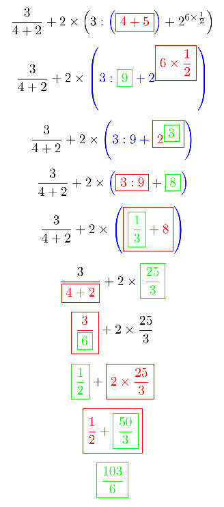

# Simplicio

**Simplicio** è un programma che semplifica espressioni matematiche mostrando tutti i passaggi fatti.

Per esempio passandogli in input l'espressione `3/(4+2)+2*(3:(4+5)+2^(6*1/2))`, l'output sarà:

<center>
    
</center>

Da notare che in ogni espressione:
- la sottoespressione tra parentesi oggetto della semplificazione (se presente) è colorata in blu,
- la sottoespressione che sta per essere semplificata è riquadrata in rosso,
- il risultato della semplificazione del passo precedente (se presente) è riquadrato in verde.

Come si può inoltre vedere dall'esempio, ad ogni passaggio viene svolta una semplificazione all'interno della parentesi più a sinistra tra quelle che che hanno il grado di annidamento massimo.

All'interno di questa parentesi le operazioni vengono svolte nel seguente ordine:
- potenze: prima l'esponente e poi la base
- frazioni: prima il numeratore e poi il denominatore
- moltiplicazioni e divisioni
- somme e sottrazioni
- operatori unari

Da notare inoltre che quando sono presenti più somme e differenze (o moltiplicazioni e divisioni) consecutivamente, vengono svolte in un solo passaggio.

## Dipendenze

Questo progetto utilizza **ANTLR4** come *parser generator*, la cui versione 4.3.9 è scaricabile dal [seguente link](https://www.antlr.org/download/antlr-4.9.3-complete.jar).

Successivamente bisogna allocare la variabile d'ambiente `ANTLR4_JAR` che contenga l'indirizzo del file scaricato.

Su Linux e MacOS digitare:
```bash
$ export ANTLR4_JAR=path
```
dove `path` è il percorso assoluto del file appena scaricato.

## Compilazione

Per generare il *lexer* ed il *parser* digitare:
```bash
$ cd simplicio/grammar/
$ java -jar $ANTLR4_JAR -visitor -no-listener -o ../src/antlr/ MathExpression.g4
```

Avendo a disposizione tutti i sorgenti è ora possibile compilare il progetto:
```shell
$ cd ../src/
$ javac -cp $ANTLR4_JAR: -d ../out/ Main.java
```

I file generati dalla compilazione vengono inseriti nella cartella `../out/`.

## Esecuzione

### Esecuzione tramite script (solo Linux e MacOS)

Per eseguire il progetto basta lanciare lo script `run.sh` con l'espressione da risolvere come parametro:
```bash
$ ./run.sh "1+2*3"
```

Lo script genererà i file sorgenti latex ed il file compilato nella directory `simplicio/output/` ed aprirà il file `dvi` con il programma predefinito di sistema.

### Esecuzione *a mano*

Per eseguire la compilazione manualmente digitare:
```shell
$ cd simplicio/
$ mkdir output
$ cd out/
$ java -cp $ANTLR4_JAR: Main "1+2*3" > ../output/latex.tex
$ cd ../output/
$ latex latex.tex
```
dove al posto di `1+2*3` va messa l'espressione da semplificare.

Dopo aver eseguito questi comandi nella cartella `output/` sarà presente il file risultante `latex.dvi`.
